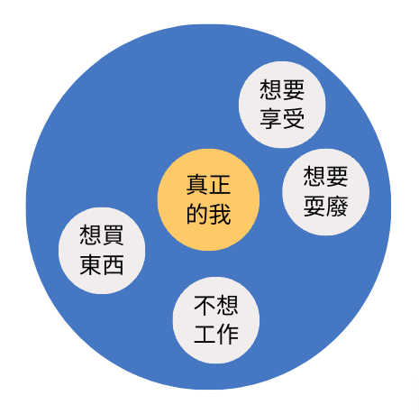
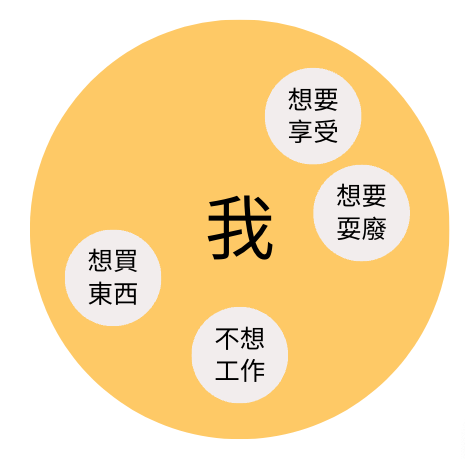

閱讀完心靈工坊 2023 年 6 月的新書《解離女孩》，分享我的讀後心得。
這是一位 DID 個案的 EMDR 治療。

## 《解離女孩》讀後心得

說來很巧，前幾日參加某心理治療所的開幕時，才和接下來的新同事們初次聊天，然後被大力推坑 EMDR（眼動減敏與歷程更新治療），「既然你對 IFS（內在家庭系統治療）有興趣，那麼，很推薦你 EMDR」語意大概是這樣，這話是他們對我說的。

有一種看待人的觀點是這樣：

一個人在成長過程中，會因為不同的經驗、對這些經驗的反應，我們會有不同的想法、衝動、感受、身體感覺等等，以上不同的元素並不會僅僅出現於事件當下，很有可能繼續留下來、陪著我們一起走我們的人生，所以每個人的內在都會有許許多多不同的部分。有些可能是你喜歡的，有些可能讓你非常折磨，我們應該要怎麼去應對他們呢？特別是面對那些我們不喜歡的部分。

對我來說，這本小說就跟這個主題有關。

《解離女孩》這本書是一本圍繞在一位解離性身份障礙症（DID）患者的精彩小說，是治療師艾迪與來談者思雅的一趟心理治療之旅，對我來說，也像是一份偽個案報告或是治療筆記。

我喜歡這本小說的原因，不只是他很好看，更個人的理由是，作者特別花一些篇幅描述心理師的內心世界以及治療室外的生活，這很接近現實生活，治療室裡的工作跟我的生活並不是完全隔離，中間好像有一層膜，看似隔開，但兩邊其實又會透過某些方式相互流動、影響。我也很喜歡作者持續標註現在是第幾次的諮商、開始諮商到現在過了多久，這讓我覺得好貼近我的工作，好可以想像。

當然我也有對這本書的擔心，當民眾對於心理治療的想像大多與談話治療有關，EMDR 可以說是一個比較冷門、特殊的療法，我不確定這本書在幫助讀者初步認識 EMDR 這方面做的如何，畢竟又不能說太多反而像是教科書、說得不夠又會太陌生。

但我相信，不論是任何對心理治療感興趣的人，或者是已經在執行心理治療的專業工作者，我相信閱讀完本書都會收穫屬於自己的禮物。

如果要再用幾句話為這本書作結，我會想到我常常有過的一個想法，有時我也會向個案分享。

如果你內在有一個你自己很不喜歡的部分，他明明是你的一部分，他存在在那裡不是故意就是要弄你、搞你，他可能有他的功能，他可能有他的意義。讓我們一起來看見他。

## 分享我演講時常用到示意圖

我們內在有很多部分。

如果我們以為有一部分是真正的自己，其他部分則不是。

如果我們瞭解每一個部分都是我們的一部分。

